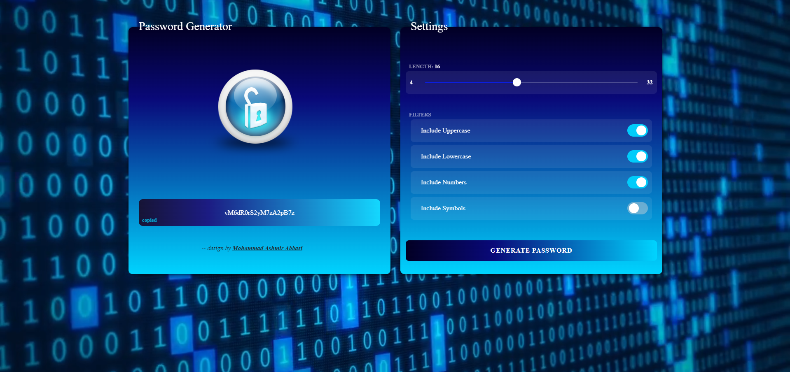

# 🔐 Introducing my latest project: a robust password generator! 🛡️✨

## 🔒 Password Generator:
- A robust and user-friendly password generator.
- Generates strong, unique passwords with customizable settings.
- Secure and easy-to-use password generator.
- Randomly generated password generator with various settings.
- Customizable password generator with options and features.

## 📸 Snaps of password generator

## 🔍 Key Features:
- Customize passwords to desired length and complexity.
- Tailor-made security filters for personalized protection.
- Generate strong, unique passwords effortlessly.
- Icons representing the technologies used:
  - 💡 HTML5
  - 🎨 CSS3
  - 🅱️ Bootstrap 5
  - 🚀 JavaScript

## Usage
1. Open link given below in your browser.
2. Select your desired filter and password length.
3. Click the "Generate" button to see your age.
4. Click the password to copy and make it safe.

## 🌐 Experience it Live: 
[live preview of Password Generator](https://your-password-generator.com)

## 👩‍💻 Contribute on GitHub: 
[Password Generator Repository](https://github.com/MohammadAshmir786/Password_Generator.git)